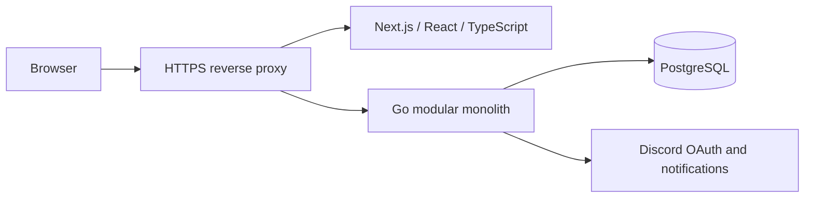

# Dung Lair Platform

A guild home and recruitment platform for **Dung Lair**, built for the WoW Forever community.

The first release gives visitors a clear introduction to the guild, lets applicants sign in with Discord, and gives officers one place to review applications. The architecture leaves room for future guild tools without expanding the first release beyond what the guild needs.

**Status:** MVP planning and repository foundation. Application implementation is tracked in M0–M3; this repository is not yet a runnable product.

## Start here

- [MVP specification](docs/product/mvp.md) — scope, user stories, and release criteria.
- [Roadmap](docs/product/roadmap.md) — M0 Foundation through M3 Discord + Polish.
- [Architecture](docs/architecture/overview.md) — boundaries, responsibilities, and deployment.
- [Documentation index](docs/README.md) — all product, engineering, and decision records.
- [Implementation backlog](docs/engineering/backlog.md) — acceptance criteria and dependencies.
- [Issues](https://github.com/brianlatulip/dung-lair-platform/issues) · [Milestones](https://github.com/brianlatulip/dung-lair-platform/milestones)

## MVP at a glance

| Audience | First-release experience |
| --- | --- |
| Visitor | Home, About, recruitment needs, and an invitation to apply |
| Applicant | Discord sign-in, application submission, and own application status |
| Officer | Application queue, review decisions, private notes, and recruitment updates |
| Admin | Internal access administration and platform configuration |

## Architecture



One Go backend, one database, and domain-oriented modules. Discord authenticates users; Dung Lair owns its user records and permissions. HTTP/JSON REST connects the frontend and backend.

## Repository map

```text
apps/
  web/                 Next.js frontend implementation boundary
  api/                 Go backend implementation boundary
packages/config/       Shared tooling when needed
infrastructure/docker/ Container and Linux deployment boundary
docs/
  product/             Vision, MVP, roadmap, future scope
  architecture/        Identity, RBAC, applications, API, data, integrations
  diagrams/            Version-controlled Mermaid diagrams
  adr/                 Architecture decision records
  engineering/         Development, delivery, testing, backlog, operations
.github/               Issue and pull-request templates
```

The implementation folders currently describe their intended contracts. M0 will add the working applications, migrations, containers, and CI; no placeholder startup commands imply that these already exist.

## Contributing

Start with [CONTRIBUTING.md](CONTRIBUTING.md), choose a tracked issue, and keep code, documentation, and diagrams consistent in the same pull request. See [development](docs/engineering/development.md) for the intended local workflow.

## License

[MIT](LICENSE). Third-party artwork and trademarks are not covered by the project’s license unless their own terms explicitly permit it.
