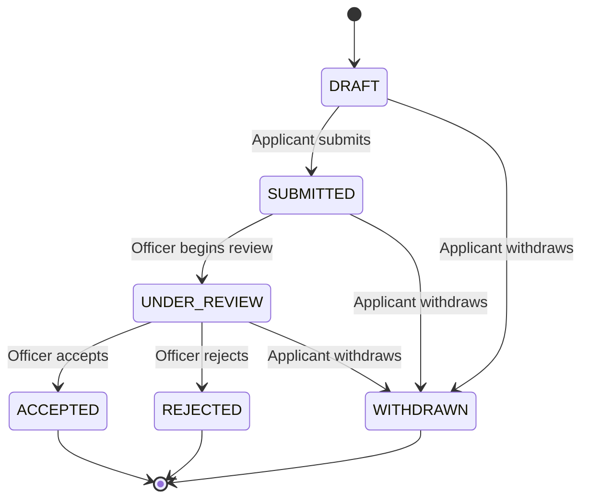

# Application domain

Applications own the answers, current status, private officer comments, and immutable review history. Provider identity belongs to Users; character details are manual application answers in the MVP.

## Proposed transition policy

The state vocabulary was agreed in planning; the allowed transitions below are a concrete proposal to settle in the M2 workflow-policy issue.

Until policy is settled, do not assume reopening, direct SUBMITTED → ACCEPTED decisions, resubmission, autosave, or multiple active applications. A submission-only UI may construct and submit a draft in one transaction; reserving DRAFT does not require shipping an autosave editor.

## Transaction rules

Validate form fields and permissions before committing. Persist the application and its submission event together. For review, check expected version/current state, apply the transition, and append an event in one transaction. Concurrent conflicting updates should return a conflict response rather than silently overwrite an officer’s decision.

Record stable application ID, applicant user ID, answers/form version, status, timestamps, and an optimistic concurrency version. Preserve submitted answers as the reviewed record; editing after submission needs an explicit policy.

Events record actor, event type, previous/next status where relevant, and timestamp. Private comments are separate records linked to an author. Keep private note text out of applicant event metadata and notification payloads.

## Integration boundary

Emit `ApplicationSubmitted { applicationID, userID }` only after the database commit. The Discord adapter receives the event and produces a minimal officer notification. Notification failure must not turn a successfully stored submission into a failed submission or cause duplicate application creation on retry.

An in-process publisher matches the accepted MVP direction. It cannot guarantee delivery across process crashes by itself. The notification issue must select and document a recovery strategy (persisted retry/outbox or reconciling unsent submissions); an external broker is not required.

## Views

Applicant: own submitted details and public status/history only. Officer: queue filters, answers, linked Discord identity, current state, private comments, and full authorized history. HTML/text input must render safely; do not allow user-entered Discord mentions to trigger broad pings.
