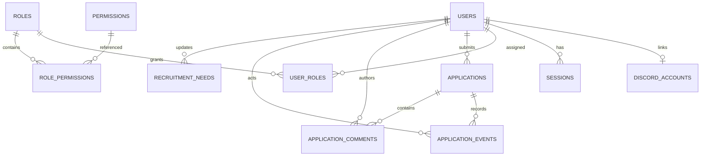

# Logical data model

This is the implementation blueprint, not a claim that migrations already exist. PostgreSQL is the source of truth; each module owns its queries and tables.

| Table | Key data and constraints | Owner |
| --- | --- | --- |
| users | UUID primary key, display name/avatar, created/updated timestamps | users |
| discord_accounts | Unique Discord user ID, user FK, display metadata | users |
| sessions | User FK, unique token hash, expiry, revocation | auth |
| roles | Unique role name | users |
| permissions | Unique permission key | users |
| user_roles | Unique user/role pair with FKs | users |
| role_permissions | Unique role/permission pair with FKs | users |
| applications | Applicant FK, status, answers/form version, submitted time, concurrency version | applications |
| application_events | Application/actor FKs, type, timestamp, safe metadata | applications |
| application_comments | Application/author FKs, private body, timestamps | applications |
| recruitment_needs | Unique class/spec key as agreed, need status, updated time/actor | recruitment |

Store Discord snowflake IDs as strings at API boundaries to avoid JavaScript integer precision loss. Keep all persisted times in UTC; display them in the viewer’s intended timezone. Use database constraints in addition to service validation.

The one-Discord-account-per-user MVP constraint can be relaxed explicitly for future providers. Applications must have indexed applicant/status/submitted-time access paths. Comments/events should be paginated and indexed by application and time.

## Migrations and lifecycle

Use ordered versioned migrations with a documented runner. Apply from empty and existing schemas in CI. Seed internal roles/permissions deterministically; never seed a production Admin based on an unverified display name. Decide answer storage (typed columns plus structured answers or versioned JSONB) and active-application uniqueness after M2 policy resolution.

Retain review history through normal workflow updates. Data deletion, retention, foreign-key delete behavior, backup encryption and access, and restoration procedures must be specified before release. No raw production application data belongs in repository fixtures.
