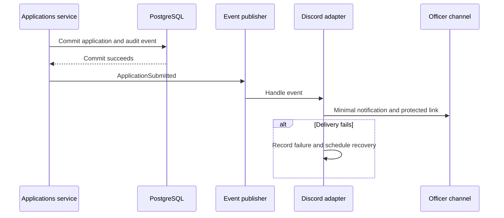

# Discord integration

Discord provides authentication and an officer notification channel. Dung Lair remains authoritative for users, permissions, applications, and review decisions.

## MVP responsibilities

- Authorization-code OAuth login through the backend.
- Link Discord identity to an internal user.
- Resolve the guild-membership policy before implementing any membership gate.
- Notify the officer channel after a committed application submission.

A notification contains only what officers need: character name, class/spec, Discord display identity, and a link to the protected application. Do not send full answers or private review notes. Disable automatic broad mentions and safely format applicant text.

## Transport and reliability

Select webhook or bot transport in M3 and record its permissions and secret requirements. A dedicated bot process is not an MVP assumption. Handle provider timeouts/rate limits with bounded retry/backoff; record correlation IDs without leaking webhook URLs or tokens. Make recovery observable and test it.

In-process event delivery alone can lose work on restart. Define durable retry/outbox or reconciliation before promising eventual notification delivery. Duplicate delivery may still occur after an ambiguous provider response; design safe content and document that limitation. A successful application stays successful even when Discord is unavailable.

Automatic role assignment, welcome messages, Discord role synchronization, Raid-Helper, and Dyno are future scope.
