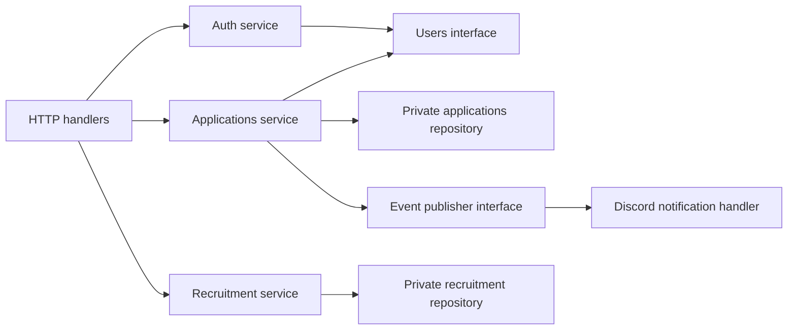

# Domain modules and repository boundaries

| Module | Owns | Public boundary |
| --- | --- | --- |
| auth | OAuth flow, session lifecycle | Authenticated principal and session operations |
| users | Internal users, linked identity records, roles/permissions | User lookup and authorization policy |
| applications | Answers, workflow, private comments, review history | Application service and domain events |
| recruitment | Recruitment needs and updates | Public read and authorized update service |
| discord | Discord transport and integration mapping | OAuth client / notification adapter |
| platform | Configuration, database connections, HTTP and logging infrastructure | Small technical primitives |

`auth` orchestrates login through Discord and the users service. Applications use user/permission interfaces; they do not query users repositories directly. Recruitment and applications do not write each other’s tables.



## Intended implementation layout

```text
apps/api/
  cmd/api/main.go
  internal/
    auth/
    users/
    applications/
    recruitment/
    discord/
    platform/{config,database,logging,http}/
  migrations/
apps/web/src/
  app/                         Next.js routes
  features/{auth,applications,recruitment,users}/
  components/ui/               Generic UI only
  lib/api/                     HTTP client contract
```

A domain can contain handler, service, repository, and model files without requiring those files before there is useful code. Avoid a shared directory full of unrelated business models. Next.js owns routes in `app/`; a second generic routes directory is unnecessary.

## Adding a module

Document its data ownership, define a narrow interface, wire dependencies at the composition root, add migrations, enforce permission rules, and cover behavior with tests. Avoid cross-domain repository imports. Update architecture diagrams and API contracts with implementation changes.
