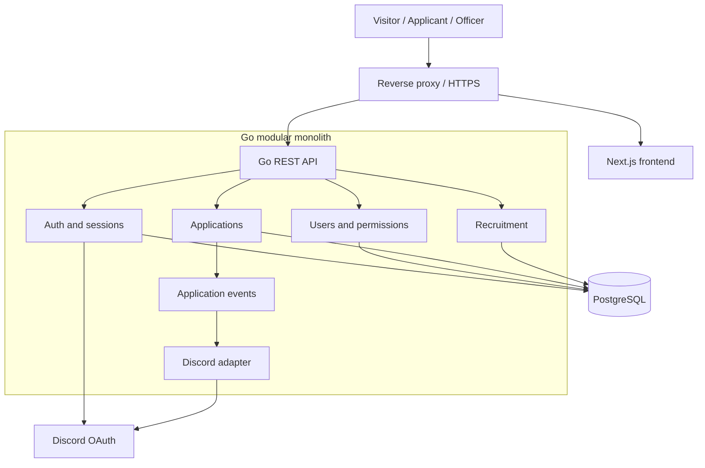

# Architecture overview

## Accepted direction

Next.js, React, and TypeScript provide the browser experience. Go owns the REST API, domain logic, identity, authorization, and integrations. PostgreSQL is the relational source of truth. Docker Compose supports local development; production runs containers on the owner’s Linux server behind HTTPS. GitHub hosts source, documentation, issues, and CI/CD.

The backend is a **modular monolith**: one deployable Go application with explicit domain boundaries and one database. A separate Discord bot, queue service, or microservice fleet is not required by the MVP.

## Ownership and trust

The frontend handles rendering and user interaction; hiding a button never substitutes for backend authorization. The API validates all input, checks ownership/permissions, executes domain transitions, and persists changes. The browser never talks directly to PostgreSQL or receives Discord secrets.

Prefer a single public origin with the reverse proxy routing `/api/v1/*` and `/auth/*` to Go, and pages to Next.js. This is a proposed deployment convention to confirm in M0/M3. It simplifies cookies and avoids creating a second competing authentication system in Next.js.

## Evolution

Add a cohesive domain module and explicit contract when a feature is needed. Keep repositories private to the owning module. Integration adapters depend on application events/interfaces, not cross-module table writes. A broker or separate worker is an evolution option, not an MVP requirement.

[Module design](modules.md) · [Authentication](authentication.md) · [RBAC](authorization.md) · [Data model](data-model.md) · [API](api.md) · [Decisions](../adr/README.md)
