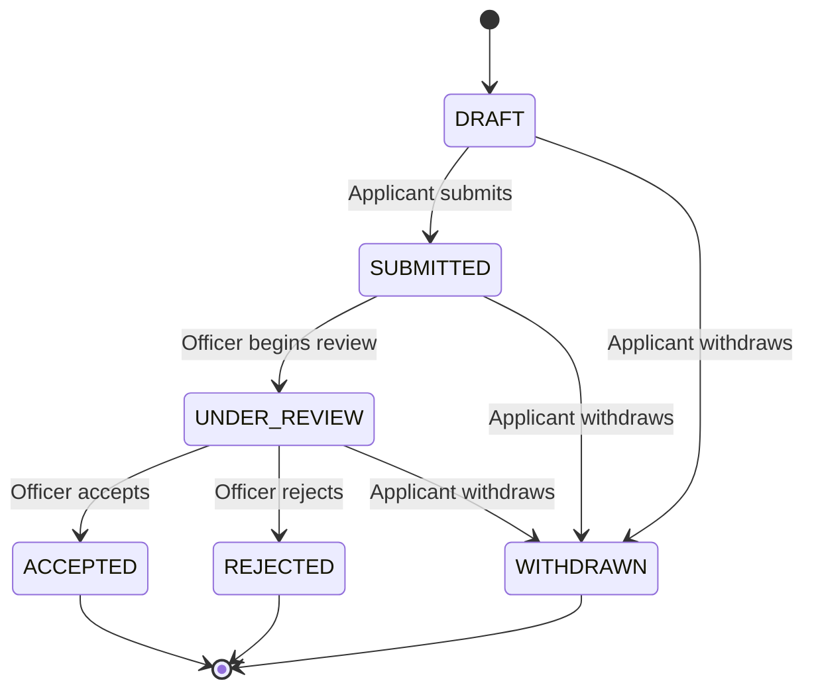

# Application State

[Design context](../architecture/applications.md). Keep this diagram synchronized with its source document.

```mermaid
stateDiagram-v2
  [*] --> DRAFT
  DRAFT --> SUBMITTED: Applicant submits
  DRAFT --> WITHDRAWN: Applicant withdraws
  SUBMITTED --> UNDER_REVIEW: Officer begins review
  SUBMITTED --> WITHDRAWN: Applicant withdraws
  UNDER_REVIEW --> ACCEPTED: Officer accepts
  UNDER_REVIEW --> REJECTED: Officer rejects
  UNDER_REVIEW --> WITHDRAWN: Applicant withdraws
  ACCEPTED --> [*]
  REJECTED --> [*]
  WITHDRAWN --> [*]
```
