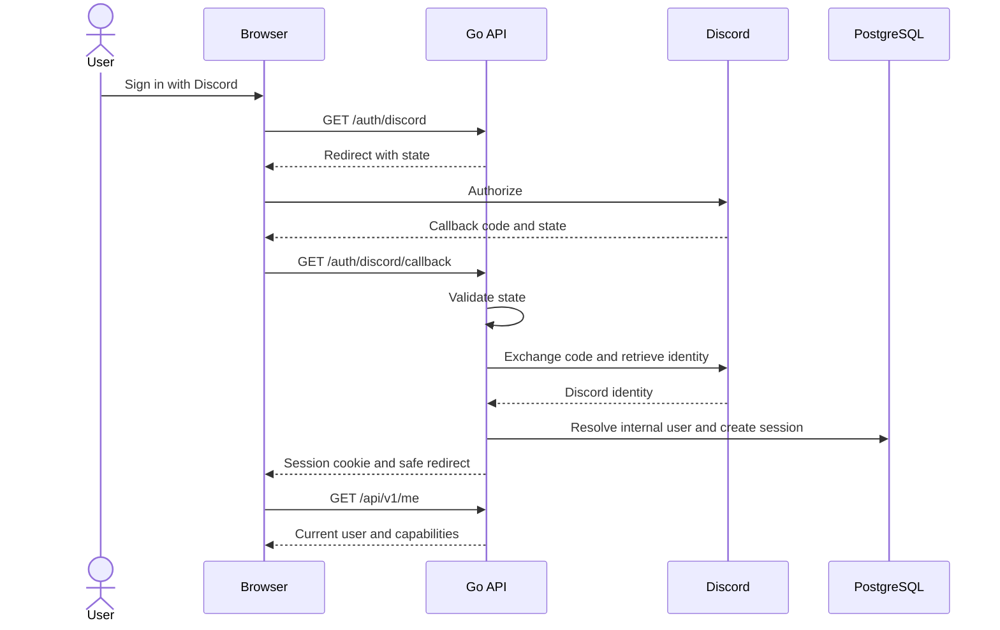

# Authentication Flow

[Design context](../architecture/authentication.md). Keep this diagram synchronized with its source document.

```mermaid
sequenceDiagram
  actor U as User
  participant W as Browser
  participant A as Go API
  participant D as Discord
  participant P as PostgreSQL
  U->>W: Sign in with Discord
  W->>A: GET /auth/discord
  A-->>W: Redirect with state
  W->>D: Authorize
  D-->>W: Callback code and state
  W->>A: GET /auth/discord/callback
  A->>A: Validate state
  A->>D: Exchange code and retrieve identity
  D-->>A: Discord identity
  A->>P: Resolve internal user and create session
  A-->>W: Session cookie and safe redirect
  W->>A: GET /api/v1/me
  A-->>W: Current user and capabilities
```
