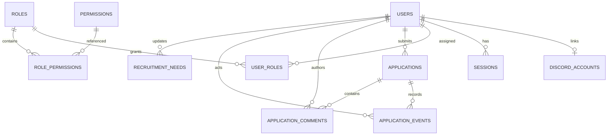

# Data Model

[Design context](../architecture/data-model.md). Keep this diagram synchronized with its source document.

```mermaid
erDiagram
  USERS ||--o| DISCORD_ACCOUNTS : links
  USERS ||--o{ SESSIONS : has
  USERS ||--o{ USER_ROLES : assigned
  ROLES ||--o{ USER_ROLES : grants
  ROLES ||--o{ ROLE_PERMISSIONS : contains
  PERMISSIONS ||--o{ ROLE_PERMISSIONS : referenced
  USERS ||--o{ APPLICATIONS : submits
  APPLICATIONS ||--o{ APPLICATION_EVENTS : records
  APPLICATIONS ||--o{ APPLICATION_COMMENTS : contains
  USERS ||--o{ APPLICATION_COMMENTS : authors
  USERS ||--o{ APPLICATION_EVENTS : acts
  USERS ||--o{ RECRUITMENT_NEEDS : updates
```
