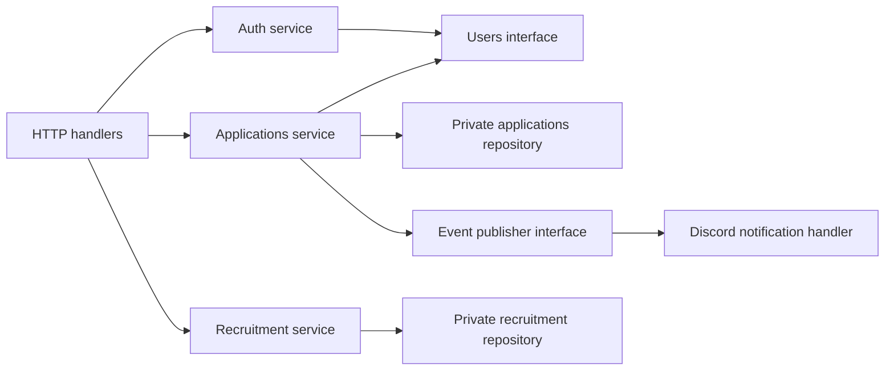

# Module Boundaries

[Design context](../architecture/modules.md). Keep this diagram synchronized with its source document.

```mermaid
flowchart LR
 HTTP[HTTP handlers] --> Auth[Auth service]
 HTTP --> App[Applications service]
 HTTP --> Rec[Recruitment service]
 Auth --> User[Users interface]
 App --> User
 App --> AppRepo[Private applications repository]
 App --> Event[Event publisher interface]
 Event --> Discord[Discord notification handler]
 Rec --> RecRepo[Private recruitment repository]
```
