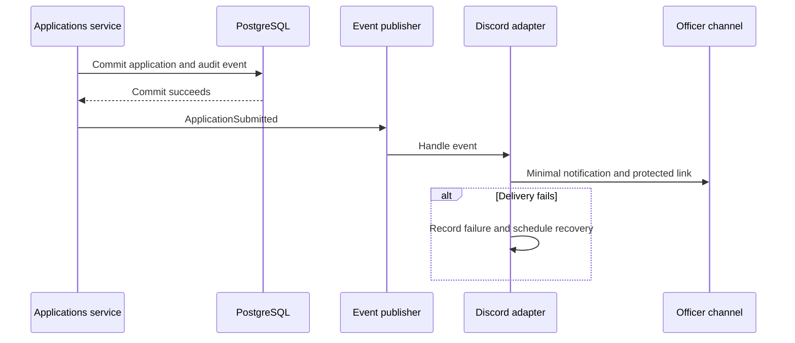

# Notification Flow

[Design context](../architecture/discord.md). Keep this diagram synchronized with its source document.

```mermaid
sequenceDiagram
 participant A as Applications service
 participant P as PostgreSQL
 participant E as Event publisher
 participant D as Discord adapter
 participant C as Officer channel
 A->>P: Commit application and audit event
 P-->>A: Commit succeeds
 A->>E: ApplicationSubmitted
 E->>D: Handle event
 D->>C: Minimal notification and protected link
 alt Delivery fails
   D->>D: Record failure and schedule recovery
 end
```
