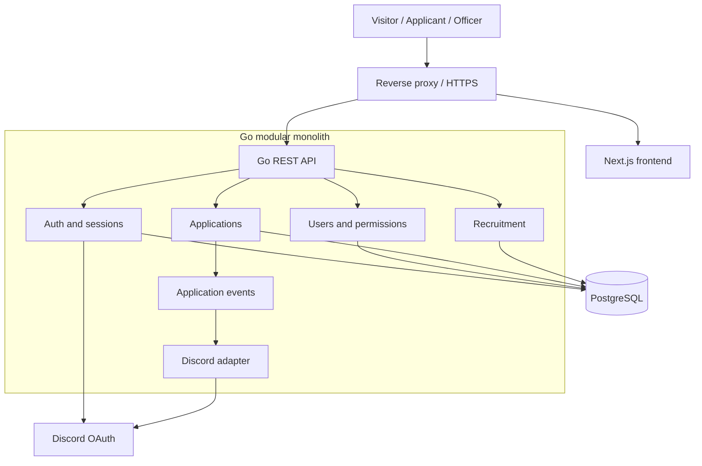

# System Context

[Design context](../architecture/overview.md). Keep this diagram synchronized with its source document.

```mermaid
flowchart TB
  Browser[Visitor / Applicant / Officer] --> Proxy[Reverse proxy / HTTPS]
  Proxy --> Web[Next.js frontend]
  Proxy --> API[Go REST API]
  subgraph Backend[Go modular monolith]
    API --> Auth[Auth and sessions]
    API --> Users[Users and permissions]
    API --> Apps[Applications]
    API --> Recruitment[Recruitment]
    Apps --> Events[Application events]
    Events --> Integration[Discord adapter]
  end
  Auth --> Discord[Discord OAuth]
  Integration --> Discord
  Auth --> DB[(PostgreSQL)]
  Users --> DB
  Apps --> DB
  Recruitment --> DB
```
