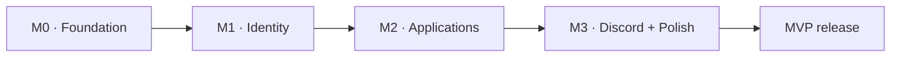

# MVP roadmap

Milestones describe outcomes, not deadlines. Dates remain unset until the owner agrees a schedule.

## M0 — Foundation

[Milestone](https://github.com/brianlatulip/dung-lair-platform/milestone/1) · [Delivery tracker #31](https://github.com/brianlatulip/dung-lair-platform/issues/31)

A reproducible local stack and engineering foundation.

**Exit gate:** Frontend and Go API start with PostgreSQL through Docker Compose; migrations, config, logging, health and CI are demonstrated.

## M1 — Identity

[Milestone](https://github.com/brianlatulip/dung-lair-platform/milestone/2) · [Delivery tracker #32](https://github.com/brianlatulip/dung-lair-platform/issues/32)

Discord sign-in with internal identity and authorization.

**Exit gate:** Repeatable login, sessions, /me, role permissions and protected routes pass positive and negative access tests.

## M2 — Applications

[Milestone](https://github.com/brianlatulip/dung-lair-platform/milestone/3) · [Delivery tracker #33](https://github.com/brianlatulip/dung-lair-platform/issues/33)

A complete applicant-to-officer review workflow.

**Exit gate:** An applicant submits and views status; officers review, change state, add private notes and see audited history.

## M3 — Discord + Polish

[Milestone](https://github.com/brianlatulip/dung-lair-platform/milestone/4) · [Delivery tracker #34](https://github.com/brianlatulip/dung-lair-platform/issues/34)

Connected recruitment experience and production MVP.

**Exit gate:** Notifications, recruitment management, responsive states, observability and production recovery checks pass.

[Implementation backlog](../engineering/backlog.md) · [Project conventions](../engineering/project-management.md)

Independent content work may overlap identity work. Protected application features depend on M1. Discord notification delivery follows durable application submission. Closing this documentation setup does not mean M0 is complete.
